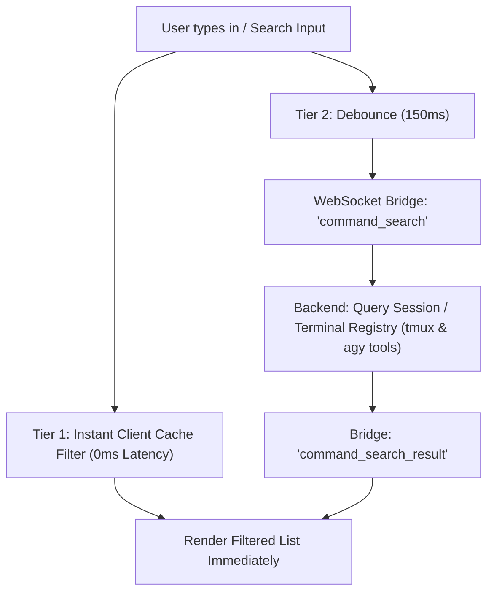

# Implementation Plan: PiG Thinking Stream, Terminal Command Sync, & E2E Testing

This plan specifies the architecture and implementation for:
1. **Dynamic Growing 7-Line Thinking Stream with Thought Syntax Highlighting**
2. **Zero-Lag Terminal Slash Command Synchronization** (`/model` and `/usage`)
3. **Exact E2E Playwright Tests** executed strictly in **Antigravity (`agy`)** using **Gemini 3.8 Flash (`--model=gemini-3.8-flash --effort=low`)**.

---

## 1. Dynamic Growing Thinking Stream with Syntax Highlighting

### Dynamic Growth & Rolling Window
- **Initial State**: When the first thought token/line arrives, the thinking container height fits **only 1 line** (~22px).
- **Growth Phase (Lines 1 → 7)**: As lines 2, 3, 4, 5, 6, and 7 arrive, the container smoothly expands in height using Reanimated timing (`pig-motion` duration 180ms ease).
- **Rolling Teleprompter (Lines 8+)**: Once 7 lines are present, any incoming line causes the oldest line (at the top) to smoothly slide up and fade out (`opacity: 0, translateY: -10px, marginTop: -22px`), while the new line enters at the bottom. The container maintains a locked height of exactly 7 lines.
- **Auto-Collapse**: The instant the first answer token arrives, the thinking box smoothly collapses to `[ (Brain Icon) Thought for Xs  ▾ ]`.
- **Full History on Demand**: Tapping the collapsed header smoothly expands to inspect the entire thought trace with vertical scrolling.

### Thought Syntax Highlighting Tokens (from `pig-color-system` & `pig-typography`)
- **Action Verbs & Keywords** (`Checking`, `Inspecting`, `Evaluating`, `Testing`, `Turn complete`): Bold primary ink (`var(--ink)`, Onest 600).
- **File Paths & Output Folders** (`.pig-output/`, `backend/src/server.ts`, `.md`, `.ts`): Muted Velvet Orchid pill (`var(--accent)` with `var(--accent-tint)` background, Roboto Mono).
- **Numbers & Durations** (`60s`, `1.10`, `8787`, `7 lines`): Amber Ochre (`var(--warning)` / `#8b6118` light, `#d2962d` dark, Roboto Mono).
- **Code & Identifiers** (backtick identifiers `` `mintRawFileTicket` ``): Flat neutral code-surface background (`var(--code-surface)` with `var(--border)`).

---

## 2. Terminal Slash Command Synchronization (Zero-Lag Architecture)

### The Challenge
Searching commands from the actual terminal/agent process in real time risks UI latency if every keystroke blocks on a round-trip to the VPS/tmux pane.

### The Solution: Two-Tier Command Synchronization

1. **Tier 1: Instant Client Cache Filter (0ms Latency)**:
   - On session load, PiG preloads all known slash commands, agent tools, and terminal built-ins (`/model`, `/usage`, `/cost`, `/compact`, `/clear`, `/doctor`).
   - Every keystroke immediately filters the visible list in-memory with zero network latency.
2. **Tier 2: Asynchronous Debounced Terminal Synchronization (150ms)**:
   - As the user types, a 150ms debounce dispatches `command_search` over the bridge.
   - The backend checks the active tmux session / agent environment:
     - For **`/model`**: reads models available to `agy` (`gemini-3.8-flash`, `gemini-3.7-flash`, etc.) and formats them.
     - For **`/usage`**: queries the live session token accumulator (input tokens, output tokens, thinking tokens, cache read).
   - The backend responds with `command_search_result`, seamlessly updating the overlay list without UI stutter.
3. **Execution on Select**:
   - Selecting `/model` opens the model picker directly in the overlay.
   - Selecting `/usage` displays the token breakdown card directly in the overlay.
   - Other terminal commands cleanly dispatch via `route_input` or tmux without leaking search keystrokes to the terminal.

---

## 3. Strict E2E Test Suite (Playwright)

Per user instructions, **Claude Code is ignored** and tests run **strictly in Antigravity (`agy`)** with model `gemini-3.8-flash` and effort `low`.

### Test 1: Antigravity Thinking Stream & Auto-Collapse
- **Configuration**:
  - Agent: `antigravity`
  - Model: `gemini-3.8-flash`
  - Reasoning effort: `low` (`--effort=low`)
- **Prompt**: Mathematical riddle or step-by-step reasoning prompt (e.g. `"A bat and a ball cost $1.10 in total. The bat costs $1.00 more than the ball. How much does the ball cost? Show your thought process."`).
- **Assertions**:
  1. UI displays the thinking stream container.
  2. Thinking container starts small (1 line) and dynamically grows up to 7 lines as thought deltas stream in.
  3. Rolling window correctly maintains a maximum of 7 visible lines, dropping the oldest lines smoothly.
  4. Thought lines have syntax highlighting applied.
  5. The moment the agent begins streaming the answer, the thinking box **auto-collapses** to `Thought for Xs [▾]`.
  6. The final answer text is displayed full-width on the canvas.
  7. Clicking the collapsed thinking bar re-expands it, allowing the user to view the full thought history.

### Test 2: Slash Command Search & Terminal Sync (`/usage` and `/model`)
- **Assertions**:
  1. Tap the **`/`** button next to **`+`** in the composer.
  2. The Slash Commands Overlay opens smoothly.
  3. Preloaded commands are visible (`/model`, `/usage`, `/cost`, `/compact`, `/clear`, `/doctor`).
  4. Type `"model"` in the search bar:
     - Verified: Instant zero-lag filtering shows `/model`.
     - Clicking `/model` opens the model picker showing `Gemini 3.8 Flash (Low)`.
     - Selecting updates the session model badge.
  5. Type `"usage"` in the search bar:
     - Verified: Instant zero-lag filtering shows `/usage`.
     - Clicking `/usage` displays the token usage metrics card (Input, Output, Thinking tokens).

---

## 4. Work Breakdown & Execution Order

1. **Step 1: Backend `agentProcess.ts` & `server.ts`**
   - Configure `resolveAgentCommand` for `antigravity` to use `--model=gemini-3.8-flash` and `--effort=low`.
   - Ensure `parseAntigravityLine` separates thoughts from answer deltas.
   - Add `command_search` bridge event handler for `/model` and `/usage`.
2. **Step 2: Frontend Components**
   - Update `ThinkingAccordion.tsx` with dynamic height expansion (1 → 7 lines) and rolling window animation.
   - Add `highlightThought` utility for thought syntax coloring.
   - Update `Composer.tsx` with the `/` button next to `+`.
   - Build `SlashCommandOverlay.tsx` with debounced terminal sync and sub-views for `/model` and `/usage`.
3. **Step 3: Playwright E2E Test Suite**
   - Write `e2e/antigravity-thinking-slash.spec.ts` matching the exact user test scenarios.
   - Execute and verify passing results.
