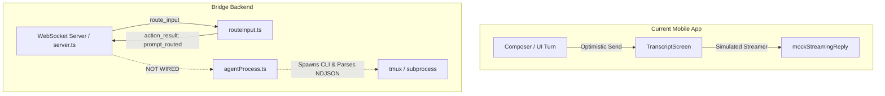
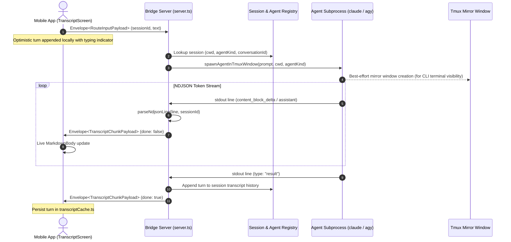

# Implementation Plan: Live Agent Process Integration (PiG Bridge & Mobile Client)

This document details the architecture and step-by-step engineering plan to wire real agent CLI executions (`claude` and `agy`) into the `pig-bridge` WebSocket daemon and stream live turns directly to the PiG mobile app.

---

## 1. Current State & Gap Analysis



### Key Gaps
1. **Server-side Execution Gap**: In `backend/src/server.ts`, `handleRouteInput` classifies prompts and returns an `action_result` (`prompt_routed`), but does not trigger `spawnAgentInTmuxWindow` in `agentProcess.ts`.
2. **Session State & Transcript Registry**: The backend does not maintain an in-memory or persisted registry of message history and running agent child processes keyed by `sessionId`.
3. **Chunk Streaming Wire**: `server.ts` does not broadcast `transcript_chunk` envelopes to the active client when stdout lines arrive.
4. **Client-side Fallback**: `src/screens/TranscriptScreen.tsx` runs `streamAgentReply` with hardcoded words from `mockStreamingReply` instead of waiting for live `client.onTranscriptChunk` events.

---

## 2. Target Architecture & Data Flow



---

## 3. Step-by-Step Implementation Roadmap

### Phase 1: In-Memory Session Transcript Registry (`backend/src/sessionRegistry.ts`)
- **Purpose**: Maintain live conversation context, working directories, agent kind, and transcript message logs per tmux session.
- **Data Structure**:
  ```typescript
  export interface ActiveSessionContext {
    sessionId: string;
    sessionName: string;
    agent: AgentKind; // 'claude-code' | 'antigravity'
    cwd: string;
    transcript: TranscriptMessage[];
    activeAgentHandle?: SpawnedAgentHandle;
    lastConversationId?: string; // For session continuation
  }
  ```
- **Capabilities**:
  - `getOrCreateSession(sessionName, cwd, agent)`
  - `appendTurn(sessionName, message)`
  - `getTranscript(sessionName): TranscriptMessage[]`

### Phase 2: Wire `route_input` to Agent Spawner in `backend/src/server.ts`
- In `handleRouteInput`:
  - When `classify(text).kind === 'prompt'`:
    1. Look up or initialize the `ActiveSessionContext`.
    2. Immediately spawn the agent CLI via `spawnAgentInTmuxWindow` in `backend/src/agentProcess.ts`.
    3. In the `onChunk` callback:
       - Wrap the chunk into `Envelope<TranscriptChunkPayload>`.
       - Broadcast to connected authenticated client sockets subscribed to that `sessionId`.
    4. On turn completion (`done === true`):
       - Store turn in `sessionRegistry`.

### Phase 3: Wire `resync_request` for Live Transcripts
- In `server.ts`'s `handleResyncRequest`:
  - When `payload.sessionId` is provided:
    - Retrieve real transcript from `sessionRegistry.getTranscript(payload.sessionId)`.
    - Return real messages in `resync_snapshot` rather than an empty list.

### Phase 4: Mobile Client Live Streaming Cutover
- In `src/screens/TranscriptScreen.tsx`:
  - Disable local simulated `streamAgentReply(replyId)`.
  - Handle `client.onTranscriptChunk`:
    - Match chunk to active turn, update markdown content live, and set status to `done` on completion.
    - If disconnected or offline, gracefully flag turn status as `error` with a retry prompt.

### Phase 5: Multi-Turn Context & Agent Continuation
- **Claude Code**:
  - First turn in session: `claude --print --output-format stream-json --include-partial-messages --verbose "<prompt>"`
  - Subsequent turns: Pass `--resume <session-id>` or continue session in the established directory so Claude remembers prior conversation context.
- **Antigravity (`agy`)**:
  - Pass the project workspace root and conversation flags.

---

## 4. Verification & Testing Strategy

1. **Automated Backend E2E Test**:
   - Extend `backend/tests/bridge-e2e.test.ts` to send a prompt, listen for real `transcript_chunk` envelopes, and assert token streaming until `done: true`.
2. **Terminal Mirror Check**:
   - Run `tmux list-windows -t <session>` on VPS to confirm the mirror window is created and visible to terminal users.
3. **Physical App Verification**:
   - Type a prompt on the paired Android device, confirm instant typing indicator, and watch live token streaming from the VPS.
