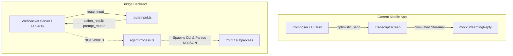
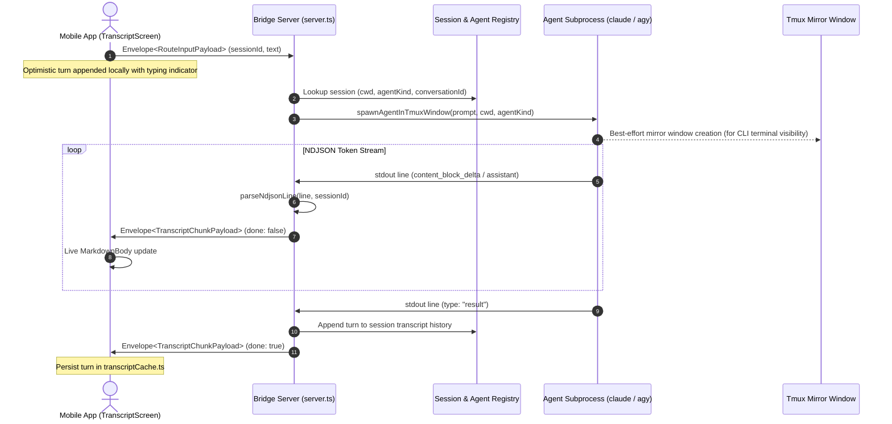
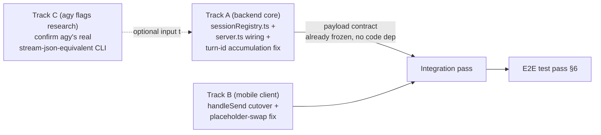

# Implementation Plan: Live Agent Process Integration (PiG Bridge & Mobile Client)

This document details the architecture and step-by-step engineering plan to wire real agent CLI executions (`claude` and `agy`) into the `pig-bridge` WebSocket daemon and stream live turns directly to the PiG mobile app.

---

## 1. Current State & Gap Analysis



### Key Gaps
1. **Server-side Execution Gap**: In `backend/src/server.ts`, `handleRouteInput` classifies prompts and returns an `action_result` (`prompt_routed`), but does not trigger `spawnAgentInTmuxWindow` in `agentProcess.ts`.
2. **Session State & Transcript Registry**: The backend does not maintain an in-memory or persisted registry of message history and running agent child processes keyed by `sessionId`.
3. **Chunk Streaming Wire**: `server.ts` does not broadcast `transcript_chunk` envelopes to the active client when stdout lines arrive.
4. **Client-side Fallback**: `src/screens/TranscriptScreen.tsx` runs `streamAgentReply` with hardcoded words from `mockStreamingReply` instead of waiting for live `client.onTranscriptChunk` events.

---

## 2. Target Architecture & Data Flow



---

## 3. Step-by-Step Implementation Roadmap

### Phase 1: In-Memory Session Transcript Registry (`backend/src/sessionRegistry.ts`)
- **Purpose**: Maintain live conversation context, working directories, agent kind, and transcript message logs per tmux session.
- **Data Structure**:
  ```typescript
  export interface ActiveSessionContext {
    sessionId: string;
    sessionName: string;
    agent: AgentKind; // 'claude-code' | 'antigravity'
    cwd: string;
    transcript: TranscriptMessage[];
    activeAgentHandle?: SpawnedAgentHandle;
    lastConversationId?: string; // For session continuation
  }
  ```
- **Capabilities**:
  - `getOrCreateSession(sessionName, cwd, agent)`
  - `appendTurn(sessionName, message)`
  - `getTranscript(sessionName): TranscriptMessage[]`

### Phase 2: Wire `route_input` to Agent Spawner in `backend/src/server.ts`
- In `handleRouteInput`:
  - When `classify(text).kind === 'prompt'`:
    1. Look up or initialize the `ActiveSessionContext`.
    2. Immediately spawn the agent CLI via `spawnAgentInTmuxWindow` in `backend/src/agentProcess.ts`.
    3. In the `onChunk` callback:
       - Wrap the chunk into `Envelope<TranscriptChunkPayload>`.
       - Broadcast to connected authenticated client sockets subscribed to that `sessionId`.
    4. On turn completion (`done === true`):
       - Store turn in `sessionRegistry`.

### Phase 3: Wire `resync_request` for Live Transcripts
- In `server.ts`'s `handleResyncRequest`:
  - When `payload.sessionId` is provided:
    - Retrieve real transcript from `sessionRegistry.getTranscript(payload.sessionId)`.
    - Return real messages in `resync_snapshot` rather than an empty list.

### Phase 4: Mobile Client Live Streaming Cutover
- In `src/screens/TranscriptScreen.tsx`:
  - Disable local simulated `streamAgentReply(replyId)`.
  - Handle `client.onTranscriptChunk`:
    - Match chunk to active turn, update markdown content live, and set status to `done` on completion.
    - If disconnected or offline, gracefully flag turn status as `error` with a retry prompt.

### Phase 5: Multi-Turn Context & Agent Continuation
- **Claude Code**:
  - First turn in session: `claude --print --output-format stream-json --include-partial-messages --verbose "<prompt>"`
  - Subsequent turns: Pass `--resume <session-id>` or continue session in the established directory so Claude remembers prior conversation context.
- **Antigravity (`agy`)**:
  - Pass the project workspace root and conversation flags.

---

## 3a. Correction found while scoping the work (2026-09-03)

Re-reading the current code before starting execution surfaced two things
that change the roadmap above:

1. **Phase 4 (mobile client cutover) is already ~90% done.**
   `TranscriptScreen.tsx` already subscribes to `client.onResyncSnapshot` and
   `client.onTranscriptChunk` and upserts messages by id (see its
   `useEffect` guarded by `if (!client) return`). What's actually still
   missing, narrower than Phase 4 as originally scoped:
   - `handleSend` never calls `client.sendRouteInput(...)` — it always runs
     the local `streamAgentReply` fake-streamer, even when a real `client`
     exists. Needs: `if (client) { client.sendRouteInput({ sessionId, text,
     attachmentIds }); } else { streamAgentReply(replyId); }` — keep the
     fake path only for the no-backend dev/demo case.
   - The locally-appended optimistic `agentReply` placeholder message (empty
     content, `status: 'streaming'`) has a **client-generated id**
     (`local-msg-${n}`). Real `transcript_chunk`s arrive with a
     **server-generated id** (see #2 below), so they won't upsert onto that
     placeholder — they'll append as a *new* row underneath it, leaving a
     permanently-empty "typing" bubble above the real reply. Fix belongs
     either client-side (drop/replace the placeholder once the first real
     chunk for this turn arrives) or server-side (echo the placeholder's id
     back — harder, since the server doesn't know the client-chosen id at
     spawn time from `route_input` alone). Client-side fix is simpler: track
     "the placeholder id I'm waiting to replace" per session and swap it out
     on first live chunk.

2. **`agentProcess.ts`'s `parseNdjsonLine` mints a fresh `randomUUID()` on
   *every* `stream_event` delta**, i.e. every token becomes a distinct
   `TranscriptMessage.id`. `TranscriptScreen`'s upsert-by-id logic means
   this would render one bubble per token instead of one growing bubble per
   turn. This must be fixed as part of Phase 2 wiring, not left for later:
   the spawn wrapper (in `server.ts`'s new call into `agentProcess.ts`, or a
   new stateful wrapper in `agentProcess.ts` itself) needs to mint **one
   `turnId` per spawned turn** and **accumulate delta text** into a running
   string, re-emitting the full accumulated text under that one id each
   time (the `'assistant'` and `'result'` event types already carry full
   text, not deltas, so those just overwrite the accumulator — safe/
   idempotent per the existing module doc). Concretely: change
   `parseNdjsonLine` to take a small mutable accumulator object (or wrap it
   in a factory `createTurnParser(sessionId): (line: string) =>
   TranscriptChunkPayload | null` closing over `turnId` + `accumulatedText`)
   rather than minting a ephemeral id every call.

---

## 4. Parallel Execution Strategy

Three tracks, split so they can run concurrently with minimal cross-blocking.
Track A is the only true dependency root; B and C can start immediately.



- **Track A — backend core** (owner: whoever picks this doc up next;
  sequential within itself):
  1. `backend/src/sessionRegistry.ts` (new) — `ActiveSessionContext` per
     §3 Phase 1, keyed by `sessionId`/`sessionName`. Needs `Session.folder`/
     `Session.agent` from `tmux.ts`'s `listTmuxSessions()` to seed `cwd`/
     `agent` on first lookup for a given session.
  2. Fix the turn-id/accumulation gap (§3a.2) — either inside
     `agentProcess.ts` (preferred, keeps `server.ts` simple) or in the
     `onChunk` wrapper `server.ts` passes to `spawnAgentInTmuxWindow`.
  3. Wire `handleRouteInput` in `server.ts`: on `classified.kind !==
     'action'` and a successful `prompt_routed` result, *also* (fire-and-
     forget, don't block the `action_result` reply) call
     `spawnAgentInTmuxWindow` with the registry's `cwd`/`agent`, broadcast
     each `onChunk` payload as a `transcript_chunk` envelope to authed
     sockets, and `sessionRegistry.appendTurn(...)` on `done: true`.
     **Important**: the existing `bridge-e2e.test.ts` asserts `route_input`
     for a plain prompt still returns `action_result` with `kind:
     'prompt_routed'` — that contract must not change; the agent spawn is
     an additional side effect, not a replacement response.
  4. Wire `handleResyncRequest` to pull `sessionRegistry.getTranscript(...)`
     for the real transcript field instead of leaving it `undefined`.
  - Depends on nothing outside itself; Track C's findings only matter for
    the `antigravity` branch of `resolveAgentCommand`, not `claude-code`.

- **Track B — mobile client cutover** (can start immediately, independent
  of Track A landing since the wire contract — `TranscriptChunkPayload`,
  `client.sendRouteInput`, `client.onTranscriptChunk` — already exists and
  is exercised today via `src/dev/mockBridgeServer.ts`):
  1. `handleSend` in `TranscriptScreen.tsx`: call `client.sendRouteInput`
     when a client exists (per §3a.1), keep `streamAgentReply` as the
     no-backend fallback only.
  2. Placeholder-swap fix (§3a.1) so the optimistic empty "streaming" bubble
     is replaced (not just supplemented) by the first real chunk.
  3. Verify against `mockBridgeServer.ts` first (fast local loop, no VPS
     round-trip), then against the real backend once Track A lands.
  - Optional stretch, not blocking: extend `mockBridgeServer.ts`'s
    `route_input` handler to also emit a couple of fake `transcript_chunk`
    envelopes, so Track B's swap-fix is testable without Track A at all.

- **Track C — `agy` CLI research** (independent, low effort, can run
  concurrently or be skipped/deferred without blocking A or B): confirm
  Antigravity's actual `--output-format`/streaming flags (the `// TODO:
  confirm agy's actual stream-json equivalent flags` in
  `resolveAgentCommand`). If nothing authoritative is found, document the
  best-guess flags and gate the `antigravity` path behind a clear runtime
  error rather than silently sending wrong flags.

**Suggested split when handed to multiple agents**: Track A and Track B as
two parallel subagent/session assignments (they touch disjoint files —
`backend/src/*.ts` vs `src/screens/TranscriptScreen.tsx` — so no merge
conflict risk); Track C folded into whichever agent has spare capacity, or
done inline by a human with VPS/CLI access to `agy --help`.

---

## 5. Verification & Testing Strategy

### 5.1 Automated backend E2E tests (extend `backend/tests/bridge-e2e.test.ts`)

The existing file covers hello/auth, session discovery, and the
create/message/kill lifecycle (with `route_input` still asserted as
`prompt_routed`, not yet asserting streaming). Add a new `test(...)` block,
**"E2E: Live agent turn streams real transcript_chunk envelopes"**, that:

1. Authenticates (`hello` → `hello_ack`) and creates a scratch tmux session
   the same way the existing lifecycle test does
   (`pig_test_stream_<timestamp>`).
2. Sends a `route_input` with a short, deterministic prompt (e.g. `"reply
   with exactly the word PONG and nothing else"`).
3. Asserts the immediate `action_result` still arrives with `kind:
   'prompt_routed'` (contract preserved, per §4 Track A step 3's note).
4. Collects every `transcript_chunk` envelope for that `sessionId` until one
   arrives with `payload.done === true` (use a generous timeout — a real
   `claude --print` turn can take several seconds; suggest 30s, not the
   existing helper's 5s default).
5. Asserts:
   - At least one `transcript_chunk` arrived before the `done: true` one
     (proves incremental streaming, not just a single lump).
   - **Every** `transcript_chunk` for this turn shares the same
     `payload.message.id` (proves the §3a.2 turn-id/accumulation fix is in
     place — this is the regression test for that specific bug).
   - The final `done: true` chunk's `message.status` is `'done'` (or
     `'error'` if the CLI call itself failed — assert the test's own prompt
     doesn't trigger that) and `message.content` is non-empty.
6. Sends a follow-up `resync_request` scoped to that `sessionId` and asserts
   `resync_snapshot.transcript` now contains the completed turn (proves
   `sessionRegistry` persistence + Phase 3 wiring).
7. Cleans up: kill the scratch session (mirrors the existing lifecycle
   test's teardown).

A second, smaller test — **"parseNdjsonLine / turn accumulator unit test"**
(new file, e.g. `backend/tests/agentProcess.test.ts`, no live process or
websocket needed) — feeds a canned sequence of NDJSON lines (a few
`stream_event`/`content_block_delta` lines, one `assistant` line, one
`result` line — the exact shapes are already captured verbatim in
`agentProcess.ts`'s module doc) through the accumulator and asserts:
   - All emitted chunks for the sequence share one `id`.
   - The final chunk's `content` equals the full expected text.
   - A malformed JSON line and a `type: 'system'` line both yield `null`.

This unit test is cheap, deterministic, and should land *with* the §3a.2
fix in Track A — it doesn't need a real `claude` binary or VPS.

### 5.2 Terminal mirror check (manual)
Run `tmux list-windows -t <session>` on the VPS after triggering a turn from
the app, to confirm the mirror window in `agentProcess.ts` is created and
visible to a human attached to the same tmux session.

### 5.3 Physical app verification (manual)
Type a prompt on the paired Android device, confirm the optimistic bubble
appears instantly, then watch it get replaced by live token streaming
sourced from the VPS (not the `mockStreamingReply` fixture) — the clearest
signal Track B's placeholder-swap fix and Track A's wiring are both correct
together.

---

## 6. Progress Log

| Date | Item | Status | Notes |
|---|---|---|---|
| 2026-09-02 | `agentProcess.ts` spawn/parse/kill (no server wiring) | ✅ Done | Verified live against real `claude --print` output on VPS; NDJSON event shapes captured in module doc. |
| 2026-09-03 | This plan drafted (§1-§3 originally, target architecture + phased roadmap) | ✅ Done | `docs/REAL_AGENT_CONNECTION_PLAN.md` created. |
| 2026-09-03 | Scoping pass before execution: found Phase 4 already ~90% built, found turn-id accumulation bug | ✅ Done | See §3a. Narrowed Track B scope, added a must-fix item to Track A. |
| 2026-09-03 | §4 parallel track breakdown + §5 e2e/unit test specs written | ✅ Done | This edit. Not yet implemented — handing off. |
| 2026-09-03 | Track A: `sessionRegistry.ts` | ✅ Done | `getOrCreateSession`/`appendTurn`/`getTranscript`/`setActiveHandle`, keyed by `sessionId` (== tmux session name throughout this codebase, confirmed via `actions.ts`). |
| 2026-09-03 | Track A: turn-id accumulation fix in `agentProcess.ts` | ✅ Done | `parseNdjsonLine` now takes a `TurnParseState`; `createTurnParser(sessionId, agent)` owns one `randomUUID()` id + accumulator per spawned turn. Regression-tested (§5.1 unit test, `backend/tests/agentProcess.test.ts`) — 10/10 pass. |
| 2026-09-03 | Track A: `server.ts` `route_input` → spawn wiring | ✅ Done | `spawnAndStreamTurn` (fire-and-forget, not awaited) resolves `cwd`/`agent` from live `listTmuxSessions()`, spawns via `spawnAgentInTmuxWindow`, broadcasts every chunk as `transcript_chunk` to all authed sockets, appends to the registry. `prompt_routed` `action_result` contract preserved (asserted by both the pre-existing lifecycle test and the new streaming e2e test). |
| 2026-09-03 | Track A: `server.ts` `resync_request` → real transcript | ✅ Done | `handleResyncRequest` now reads `sessionRegistry.getTranscript(sessionId)`; `transcript`/`syncCursor` only included when the registry has seen that session (matches `getTranscript`'s `undefined`-vs-`[]` contract). |
| 2026-09-03 | Track B: `TranscriptScreen.tsx` `handleSend` → `client.sendRouteInput` cutover | ✅ Done | `handleSend` now calls `client.sendRouteInput({ sessionId, text, attachmentIds: attachments.map(a => a.id) })` when `client` exists; `streamAgentReply` kept only as the no-backend fallback. |
| 2026-09-03 | Track B: placeholder-swap fix for optimistic bubble | ✅ Done | Added `pendingPlaceholderIdRef` (keyed by sessionId) set in `handleSend` when routing to a real client; `onTranscriptChunk` replaces the placeholder by array index on the first chunk for that turn, then clears the ref, falling back to normal upsert-by-id after that. |
| 2026-09-03 | Track C: confirm `agy` CLI streaming flags | ✅ Done | Verified live: `agy` uses Go-flag-style `--print=<prompt>` (NOT a separate positional argv entry like claude's `--print "text"` — that form errors). Real NDJSON shape captured (`event`/`step_update`/`result`, structurally unrelated to claude's `type`/`stream_event`/`assistant`/`result`) and implemented in `parseAntigravityLine` — see its doc in `agentProcess.ts` for the full catalogue. 4/4 antigravity unit tests pass; not yet covered by a live e2e test (§5.1's e2e test only exercises `claude-code`; an `agy`-specific e2e test would need a session tagged `antigravity`, which today only happens via `tmux.ts`'s window-name heuristic — a reasonable follow-up, not done here). |
| 2026-09-03 | §5.1 backend e2e streaming test | ✅ Done | `backend/tests/bridge-e2e.test.ts`: new `test('E2E: Live agent turn streams real transcript_chunk envelopes', ...)`. Run live against the real `claude` CLI on this VPS (via the `pig-bridge` systemd service, restarted to pick up the new code): 4 chunks collected, all sharing one message id, `resync_snapshot` returned the completed turn, scratch session cleaned up. |
| 2026-09-03 | §5.1 `parseNdjsonLine`/accumulator unit test | ✅ Done | `backend/tests/agentProcess.test.ts`, both `claude-code` and `antigravity` shapes covered (10 tests total). |
| — | §5.2 tmux mirror manual check | ⬜ Not started | Not run this session — `createMirrorTmuxWindow` is exercised as a side effect of the e2e test's scratch sessions but its visibility wasn't manually inspected via `tmux list-windows`. |
| — | §5.3 physical device manual check | ⬜ Not started | Needs a paired Android device — out of scope for this session. |

**Full backend suite as of this entry: `npm test` in `backend/` — 22/22 passing** (10 unit + 12 e2e, run against the live `pig-bridge` systemd service on this VPS with the real `claude` CLI). `npm run typecheck` clean across the whole repo except one pre-existing, unrelated error in `src/screens/FileExplorerScreen.tsx` (not touched by this work).

*Update this table in place as each item lands — status ✅/🔄/⬜, one row per
item, keep the Notes column pointing at the actual commit/PR once one
exists.*
