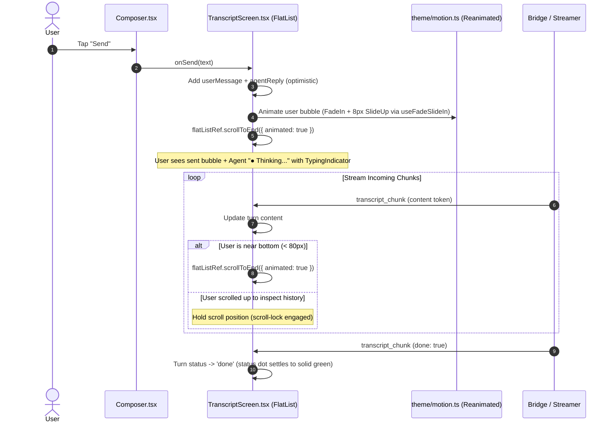

# Plan: Smooth Chat Interaction, Auto-Scroll, & Agent Loading Animation

## 1. Context & Universal Motion Standards

This plan executes the chat interaction specifications of the **`pig-motion`** skill (mirrored in [`.claude/skills/pig-motion`](../.claude/skills/pig-motion/SKILL.md) and [`.agents/skills/pig-motion`](../.agents/skills/pig-motion/SKILL.md)), alongside **`pig-loading-states`** and **`pig-keyboard-handling`**.

### Universal Motion Principles
- **Single Animation Library**: React Native Reanimated 3 exclusively.
- **Notes-App Restraint**: Subtle, non-distracting motion ($100\text{ms} - 220\text{ms}$).
- **Page-by-Page Motion Map (from `pig-motion`)**:
  - **Setup (`SetupScreen`)**: Viewfinder laser translate loop, connecting checkmark scale bounce, dev accordion expansion.
  - **Sessions (`SessionsScreen`)**: Staggered card cascade (`STAGGER_OFFSET_MS = 30ms`), swipe-to-kill row collapse, sheet slide-up.
  - **Transcript (`TranscriptScreen`)**: Instant sent bubble entrance (`useFadeSlideIn`), auto-scroll to bottom, 3-dot typing pulse (`useTypingDotPulse`), token-streaming scroll follow with scroll-lock protection.
  - **File Explorer (`FileExplorerScreen`)**: Smooth horizontal breadcrumb centering, horizontal folder slide, viewer sheet drawer.
  - **Browser (`BrowserScreen`)**: Tab strip sliding pill indicator, URL focus glow, loading line.
  - **Settings (`SettingsScreen`)**: Native switch spring, micro press scale (`usePressScale`).

---

## 2. Identified Problems in Current Chat Implementation

1. **No Auto-Scroll on Send**:
   `TranscriptScreen.tsx` does not attach a `ref` to `<FlatList>` and contains no `scrollToEnd()` logic. Sending a message leaves the viewport stationary, forcing the user to manually drag up to see their new turn.
2. **Missing Sent Delivery Confirmation**:
   Message rows lack entrance transitions (`useFadeSlideIn`) and visual send-state confirmation (e.g. status indicator or animated appearance confirming delivery to the local store and bridge).
3. **Jarring Agent Turn Arrival**:
   When the agent turn is injected, it appears abruptly without an entrance animation.
4. **No Real-Time Streaming Auto-Scroll**:
   As streaming tokens arrive and the Markdown content grows, the FlatList does not follow the bottom edge, leaving new content off-screen.
5. **Keyboard Occlusion**:
   When the mobile keyboard opens or closes, the viewport does not adjust to keep the most recent message pinned above the composer.

---

## 3. Architecture & Interaction Design



---

## 4. Detailed Implementation Steps

### Step 1: FlatList Ref & Auto-Scroll Controller in `TranscriptScreen.tsx`
- Attach `flatListRef = useRef<FlatList<TranscriptMessage>>(null)`.
- Track user scroll position via `onScroll`:
  ```typescript
  const isNearBottomRef = useRef(true);
  const handleScroll = (event: NativeSyntheticEvent<NativeScrollEvent>) => {
    const { contentOffset, layoutMeasurement, contentSize } = event.nativeEvent;
    const distanceToBottom = contentSize.height - (contentOffset.y + layoutMeasurement.height);
    isNearBottomRef.current = distanceToBottom < 80;
  };
  ```
- Trigger smooth scroll:
  - **On User Send**: Force `flatListRef.current?.scrollToEnd({ animated: true })` immediately.
  - **On Content Growth (`onContentSizeChange`)**: If `isNearBottomRef.current` is true, smoothly call `scrollToEnd({ animated: true })`.
  - **On Keyboard Show**: Scroll to bottom when `useKeyboardVisible()` flips to true.

### Step 2: Animated Message Entrance (`renderItem`)
- Wrap each message turn in an `Animated.View` utilizing `useFadeSlideIn()` from `src/theme/motion.ts`.
- For new arrivals:
  - 220ms ease-out cubic fade.
  - 8px upward slide.
  - Immediate visual confirmation: bubble renders with "just now" timestamp and clear active contrast.

### Step 3: Agent Loading & Thinking Indicator Polish
- Ensure the agent turn renders immediately with:
  - Header: `Agent`, status dot pulsing with `useStatusDotPulse(true)` while awaiting data.
  - Body: `<TypingIndicator />` rendering three staggered pulsing dots with `useTypingDotPulse(0/1/2)`.
- As soon as the first token arrives:
  - Transition cleanly from `<TypingIndicator />` to `<MarkdownBody />`.
  - Status dot changes from thinking pulse to streaming pulse.
- When turn completes:
  - Status dot settles to solid (non-pulsing) success dot per `pig-motion` rule.

### Step 4: Fluid Streaming Auto-Scroll with Scroll-Lock Protection
- Wrap scroll triggers in a throttle or `requestAnimationFrame` to prevent layout thrashing during high-speed token arrival (e.g. 20–30 chunks/sec).
- If the user explicitly scrolls up to read prior messages, `isNearBottomRef` becomes false, temporarily disabling auto-scroll so the user can read without being yanked down.

---

## 5. Verification Plan

1. **Send & Snap Test**:
   - Type a prompt and tap Send. Verify the message enters with a smooth 8px slide-up and the FlatList instantly scrolls to reveal the user bubble.
2. **Typing Indicator Test**:
   - Confirm three pulsing dots appear immediately beneath the Agent header before tokens stream in.
3. **Live Streaming Follow Test**:
   - Verify that as multiple paragraphs stream in, the FlatList continuously and smoothly tracks the bottom line.
4. **Scroll-Lock Test**:
   - While text is streaming, scroll up manually. Confirm auto-scroll disengages and doesn't yank the viewport downward. Scroll back to bottom and confirm auto-scroll re-engages.
5. **Reduced Motion Compliance**:
   - Toggle system reduced-motion setting; confirm animations gracefully degrade to instant renders without errors.
